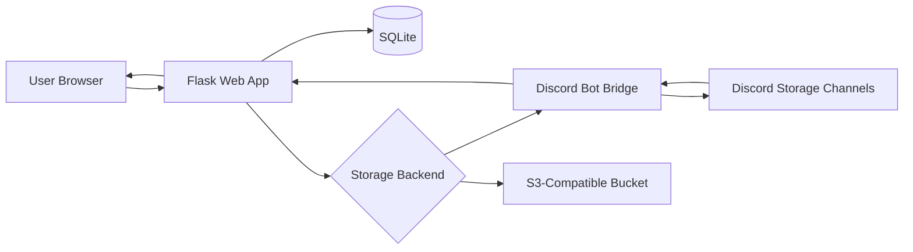

# NovaDrive

**NovaDrive** is a Google Drive inspired web app that supports **Discord or S3-compatible object storage as the backend**.

NovaDrive buffers incoming files temporarily, splits them into verified chunks, writes those chunks through the active storage backend, and stores the full manifest in SQLite for download, verification, search, sharing, WebDAV access, and administration.

It is designed as a **real, production-structured MVP**, not a throwaway demo.

## Why NovaDrive exists

NovaDrive explores a fun but serious architectural idea:

- Use Discord channels or an S3-compatible bucket as the durable blob store
- Use Flask + SQLAlchemy as the control plane
- Use SQLite for metadata, indexing, manifests, and auditability
- Keep uploads verifiable with SHA256 at both chunk and file level
- Make the UX feel like a real startup product, not an admin dashboard from 2015

This repo gives you a clean base to keep building from.

## Highlights

- Secure authentication with hashed passwords and signed session cookies
- One-time bootstrap admin account with forced username, email, and password rotation on first sign-in
- Public registration toggle so the site can run as login-only while admins create accounts manually
- Optional SMTP-backed email verification for account activation
- SMTP-backed password recovery links with signed reset URLs
- Optional TOTP two-factor authentication for browser login
- WebDAV support for direct upload, download, folder creation, delete, and move from desktop/mobile clients using per-user app passwords
- S3-compatible storage mode for AWS S3, MinIO, and other compatible providers
- Per-user storage quotas with a 10 GB default cap for standard users and admin overrides from the admin console
- Expanded admin console with account creation, role/profile/quota controls, and direct user-drive management
- Nested folders with ownership-aware create, move, rename, and delete flows
- File upload, rename, move, soft delete, hard delete, and verified download
- ShareX-compatible file, image, and text uploads with per-user API keys and generated `.sxcu` config
- Chunk manifests stored in SQLite with backend references, locators, and checksums
- Share links with optional expiry, inline media playback, raw links, and text file rendering
- Search, filtering, recent activity, storage usage summaries, and admin health visibility
- Pluggable storage backend abstraction for Discord or S3-compatible providers
- Docker and Docker Compose support plus a GitHub Actions image build workflow
- Dark premium UI with Tailwind, Jinja, glassmorphism panels, and polished dashboard flows

## Tech stack

- **Backend:** Python
- **Web framework:** Flask
- **Database:** SQLite with SQLAlchemy
- **Migrations:** Flask-Migrate / Alembic
- **Auth:** Flask-Login + Flask-WTF + Werkzeug password hashing
- **Object storage:** Discord bot bridge or S3-compatible storage
- **Frontend:** Jinja2 templates + Tailwind CSS + a small amount of vanilla JavaScript

## Architecture at a glance



### Request flow

1. A user uploads a file through the web UI.
2. Flask buffers the file temporarily in a spooled temp file.
3. NovaDrive computes the full-file SHA256 while streaming the upload.
4. The file is split into chunks according to the configured chunk size.
5. Each chunk is sent to the active storage backend.
6. NovaDrive stores the returned backend references, locators, chunk checksums, and manifest metadata in SQLite.
7. On download, NovaDrive fetches the chunks back in order, verifies each chunk hash, rebuilds the file, verifies the final SHA256, and serves the file to the client.

## Why there are two processes

When `STORAGE_BACKEND=discord`, NovaDrive intentionally separates the web app and the Discord bot:

- The **Flask app** owns HTTP requests, sessions, forms, templates, and database writes.
- The **Discord bot** owns Discord connectivity, attachment uploads, message fetches, and deletion.

That split keeps the codebase cleaner and avoids mixing Flask request handling with long-lived async Discord state. When `STORAGE_BACKEND=s3`, the web app talks directly to the configured S3-compatible API instead.

## Project structure

```text
novadrive/
  app.py                  Flask app factory and CLI commands
  config.py               Environment-driven configuration
  discord_bot.py          Discord bot + local HTTP bridge
  extensions.py           Flask extension instances
  forms.py                WTForms definitions
  models.py               SQLAlchemy models
  routes/                 Flask blueprints
  services/               Business logic and storage orchestration
  static/                 Tailwind source, built CSS, and JS
  templates/              Jinja layouts and pages
  utils/                  Hashing, chunking, validation, logging helpers
migrations/               Migration notes / future Alembic output
run.py                    Simple app runner
requirements.txt          Python dependencies
package.json              Tailwind build tooling
tailwind.config.js        Tailwind theme config
.env.example              Environment template
README.md                 You are here
```

## Core modules

- [novadrive/app.py](novadrive/app.py): app factory, error handlers, CLI commands
- [novadrive/models.py](novadrive/models.py): users, folders, files, manifests, chunks, share links, activity, sessions
- [novadrive/services/file_service.py](novadrive/services/file_service.py): uploads, chunk orchestration, rename/move/delete, rebuild validation
- [novadrive/services/s3_storage.py](novadrive/services/s3_storage.py): S3-compatible backend for AWS S3, MinIO, and similar providers
- [novadrive/services/discord_storage.py](novadrive/services/discord_storage.py): HTTP client for the bot bridge
- [novadrive/services/webdav_service.py](novadrive/services/webdav_service.py): WebDAV auth, path resolution, and file/folder operations
- [novadrive/services/verification_service.py](novadrive/services/verification_service.py): email confirmation token generation and validation
- [novadrive/discord_bot.py](novadrive/discord_bot.py): live Discord upload/fetch/delete logic
- [novadrive/routes/api.py](novadrive/routes/api.py): ShareX upload API, API key management, and SXCU generation
- [novadrive/utils/urls.py](novadrive/utils/urls.py): proxy-aware public URL generation for shares, ShareX, and email links
- [novadrive/routes](novadrive/routes): auth, dashboard, files, folders, share, WebDAV, API, and admin blueprints

## Feature coverage

### Authentication

- User registration
- User login/logout
- Password hashing
- Session cookie auth
- One-time bootstrap admin account is created automatically on a fresh database
- Public self-registration can be disabled so only admin-created accounts can sign in
- Optional email verification before password login and WebDAV access
- Optional password recovery emails with signed, time-limited reset URLs
- Optional TOTP-based two-factor authentication for browser logins
- Per-user WebDAV app password generation and rotation without exposing the main account password to clients
- Basic `admin` and `user` role model with admin role reassignment from the admin console
- Default per-user storage caps with admin-adjustable per-account quota overrides
- Admin-created accounts with controlled verification state, role assignment, direct password resets, and forced password change on next login

### File management

- Upload files into the active storage backend
- Chunk files according to the configured storage chunk size
- Persist chunk metadata in SQLite
- Rebuild files in exact order
- Validate chunk checksums and final file hash
- Rename, move, view metadata, soft delete, hard delete
- Duplicate filename conflict handling

### Folder system

- Nested folders
- Create, rename, move, delete
- Ownership-aware access checks
- Breadcrumb navigation and folder tree rendering

### Sharing

- Tokenized share links
- Optional expiry
- Public download by token
- Public image, video, audio, and text previews by token
- Global sharing toggle via config

### WebDAV

- Basic-auth WebDAV endpoint scoped to the authenticated user's drive
- `PROPFIND`, `GET`, `HEAD`, `PUT`, `MKCOL`, `DELETE`, `MOVE`, and `OPTIONS`
- Desktop and mobile client support using username/email plus a generated WebDAV app password
- Works for verified multi-user accounts without exposing the global admin view
- The bootstrap admin must complete the forced credential-change flow before WebDAV auth is allowed

### ShareX uploads

- Header-authenticated upload API for ShareX custom uploaders
- Per-user API key generation and revocation
- One-click `.sxcu` export from the dashboard
- File, image, and text upload support through the same endpoint
- Share link response payloads with preview, raw, and download URLs
- Reverse-proxy-safe URL generation when `APP_EXTERNAL_URL` is set correctly

### Admin surface

- User list
- Direct account creation from the admin console
- File, folder, and storage totals
- Recent activity log
- Storage backend health snapshot
- Storage config visibility
- User role management
- Per-user storage quota management
- User profile editing, password resets, forced password change flags, verification toggles, and direct workspace browsing
- Admin-side file and folder deletion inside a selected user's drive
- Default admin bootstrap protection so only one built-in admin account is ever auto-created

## Quick start

If you just want to boot NovaDrive locally, this is the fastest path.

### 1. Create a Python virtual environment

Windows PowerShell:

```powershell
python -m venv .venv
.venv\Scripts\Activate.ps1
```

Linux or macOS:

```bash
python -m venv .venv
source .venv/bin/activate
```

### 2. Install Python dependencies

```bash
pip install -r requirements.txt
```

### 3. Install frontend tooling and build Tailwind

```bash
npm install
npm run build:css
```

Use this during UI work:

```bash
npm run watch:css
```

### 4. Create your environment file

Copy `.env.example` to `.env` and fill in the required values:

```bash
cp .env.example .env
```

Windows PowerShell alternative:

```powershell
Copy-Item .env.example .env
```

At minimum, set:

- `SECRET_KEY`
- `STORAGE_BACKEND`
- `APP_EXTERNAL_URL` if the app is accessed through a public domain, HTTPS reverse proxy, Cloudflare, or anything other than the local Flask URL
- If using Discord: `DISCORD_BOT_TOKEN`, `DISCORD_GUILD_ID`, `DISCORD_STORAGE_CHANNEL_IDS`, and `DISCORD_BOT_BRIDGE_SHARED_SECRET`
- If using S3: `S3_BUCKET_NAME`, `S3_ACCESS_KEY_ID`, and `S3_SECRET_ACCESS_KEY`

### 5. Initialize the database

Quick bootstrap:

```bash
flask --app novadrive.app:create_app init-db
```

Migration-based workflow:

```bash
flask --app novadrive.app:create_app db init
flask --app novadrive.app:create_app db migrate -m "Initial schema"
flask --app novadrive.app:create_app db upgrade
```

### 6. Start the web app

```bash
flask --app novadrive.app:create_app run --debug
```

Alternative:

```bash
python run.py
```

### 7. Start the Discord bot bridge in another terminal if you are using Discord storage

```bash
python -m novadrive.discord_bot
```

If `STORAGE_BACKEND=s3`, you can skip this step.

### 8. Open NovaDrive

For a public or reverse-proxied deployment, open:

```text
https://your-host
```

For local development without TLS, open:

```text
http://127.0.0.1:5000
```

On a fresh database, NovaDrive creates a one-time bootstrap admin account automatically:

- Email: `admin@example.com`
- Password: `changeme123`

After signing in with that default admin account, NovaDrive forces you to change all three of these before you can use the dashboard normally:

- username
- email
- password

The default admin is only bootstrapped once per database and is not recreated automatically later.

If `EMAIL_VERIFICATION_REQUIRED=true`, new accounts must confirm their email before normal login and WebDAV access are enabled.

If `ALLOW_PUBLIC_REGISTRATION=false`, the public `/auth/register` page is disabled and users must be created by an admin or through the CLI.

If SMTP is configured, NovaDrive also exposes a `Forgot password?` flow on the login page and a password recovery action inside the admin user details screen.

If NovaDrive sits behind nginx, Traefik, Caddy, Cloudflare, or another reverse proxy, set `APP_EXTERNAL_URL` to the public host you want NovaDrive to generate:

```text
APP_EXTERNAL_URL=https://drive.example.com
```

You can also omit the scheme and let NovaDrive infer it:

- `drive.example.com` becomes `https://drive.example.com`
- `192.168.1.107:5000` becomes `http://192.168.1.107:5000`
- `localhost:5000` becomes `http://localhost:5000`

That value is used when NovaDrive generates:

- verification emails
- ShareX upload endpoints inside exported `.sxcu` files
- public share, raw, and download links
- WebDAV endpoint examples shown in the UI

## Discord setup guide

Skip this entire section if `STORAGE_BACKEND=s3`.

To make the Discord storage layer work properly:

1. Create a bot application in the Discord Developer Portal.
2. Generate a bot token and place it in `DISCORD_BOT_TOKEN`.
3. Invite the bot to your Discord server.
4. Create one or more private channels to act as storage buckets.
5. Put those channel IDs into `DISCORD_STORAGE_CHANNEL_IDS`, comma-separated.
6. Set `DISCORD_GUILD_ID` to the target server ID.

Recommended bot permissions:

- View Channels
- Send Messages
- Attach Files
- Read Message History
- Manage Messages

`Manage Messages` is needed if you want hard-delete support to remove Discord chunk messages.

## Environment variables reference

| Variable | Purpose | Example |
| --- | --- | --- |
| `SECRET_KEY` | Flask session signing secret | `super-long-random-secret` |
| `DATABASE_URL` | SQLAlchemy database URL | `sqlite:///instance/novadrive.db` |
| `APP_EXTERNAL_URL` | Public base URL used in verification emails, ShareX configs, and generated share links. If no scheme is provided, NovaDrive infers `https://` for domains and `http://` for IPs or localhost. | `drive.example.com` |
| `CLOUDFLARE_TUNNEL_COMPAT` | Clamp uploads to a Cloudflare-compatible request size before Cloudflare returns `413 Payload Too Large` | `true` |
| `CLOUDFLARE_TUNNEL_PLAN` | Cloudflare upload plan preset: `free`, `pro`, `business`, or `enterprise`. NovaDrive applies a built-in safe request cap for the selected plan. | `free` |
| `MAX_UPLOAD_SIZE_BYTES` | Max allowed upload request size through Flask before any optional Cloudflare compatibility clamp is applied | `536870912` |
| `SPOOL_MAX_MEMORY_BYTES` | Max in-memory temp spool before disk spill | `8388608` |
| `TEXT_PREVIEW_MAX_BYTES` | Max text bytes rendered inline on preview pages | `1048576` |
| `DEFAULT_USER_STORAGE_QUOTA_BYTES` | Default storage cap applied to new non-admin users | `10737418240` |
| `DEFAULT_ADMIN_STORAGE_QUOTA_BYTES` | Default storage cap applied to new admin users, `0` for unlimited | `0` |
| `SESSION_COOKIE_SECURE` | Marks login cookies as HTTPS-only in production | `true` |
| `PERMANENT_SESSION_LIFETIME_HOURS` | Persistent login lifetime | `24` |
| `ALLOW_PUBLIC_REGISTRATION` | Enables or disables the public `/auth/register` page. When `false`, only existing accounts can sign in and admins/CLI must create users. | `true` |
| `TWO_FACTOR_ISSUER_NAME` | Issuer label written into TOTP authenticator app entries during 2FA setup | `NovaDrive` |
| `STORAGE_BACKEND` | Primary blob backend, `discord` or `s3` | `s3` |
| `ALLOW_PUBLIC_SHARING` | Enables share link generation | `true` |
| `SOFT_DELETE_ENABLED` | Keeps deleted items out of active view by default | `true` |
| `WEBDAV_ENABLED` | Enables the built-in WebDAV endpoint | `true` |
| `WEBDAV_REALM` | HTTP auth realm shown to WebDAV clients | `NovaDrive WebDAV` |
| `S3_ENDPOINT_URL` | Optional custom S3 endpoint for MinIO or self-hosted APIs | `https://minio.example.com` |
| `S3_REGION` | S3 region name | `us-east-1` |
| `S3_ACCESS_KEY_ID` | S3 access key ID | `...` |
| `S3_SECRET_ACCESS_KEY` | S3 secret access key | `...` |
| `S3_SESSION_TOKEN` | Optional temporary session token | `...` |
| `S3_BUCKET_NAME` | Bucket used for NovaDrive chunk objects | `novadrive-prod` |
| `S3_PREFIX` | Optional object key prefix under the bucket | `novadrive` |
| `S3_FORCE_PATH_STYLE` | Force path-style requests for MinIO/self-hosted setups | `true` |
| `S3_PRESIGN_TTL_SECONDS` | Reserved S3 URL lifetime setting for future integrations | `900` |
| `EMAIL_VERIFICATION_REQUIRED` | Require email confirmation before password login | `true` |
| `EMAIL_VERIFICATION_MAX_AGE_SECONDS` | Verification link lifetime | `86400` |
| `EMAIL_VERIFICATION_RESEND_INTERVAL_SECONDS` | Minimum resend interval | `60` |
| `PASSWORD_RESET_MAX_AGE_SECONDS` | Password recovery link lifetime in seconds | `3600` |
| `PASSWORD_RESET_RESEND_INTERVAL_SECONDS` | Minimum interval between password recovery emails to the same account | `60` |
| `SMTP_HOST` | SMTP host for outbound mail | `smtp.mailgun.org` |
| `SMTP_PORT` | SMTP port | `587` |
| `SMTP_USERNAME` | SMTP username | `postmaster@example.com` |
| `SMTP_PASSWORD` | SMTP password | `...` |
| `SMTP_USE_TLS` | Enable STARTTLS | `true` |
| `SMTP_USE_SSL` | Connect with SMTPS | `false` |
| `SMTP_FROM_EMAIL` | Sender email address | `noreply@example.com` |
| `SMTP_FROM_NAME` | Sender display name | `NovaDrive` |
| `SMTP_TIMEOUT_SECONDS` | SMTP connection timeout | `20` |
| `DISCORD_BOT_TOKEN` | Bot token for Discord connectivity | `...` |
| `DISCORD_GUILD_ID` | Discord server ID | `123456789012345678` |
| `DISCORD_STORAGE_CHANNEL_IDS` | Comma-separated storage channel IDs | `111...,222...` |
| `DISCORD_ATTACHMENT_LIMIT_BYTES` | Attachment size ceiling to respect | `8000000` |
| `DISCORD_CHUNK_MARGIN_BYTES` | Safety margin under that ceiling | `262144` |
| `DISCORD_CHUNK_SIZE_BYTES` | Explicit chunk size override | `7737856` |
| `DISCORD_BOT_BRIDGE_URL` | HTTP address of the bot bridge | `http://127.0.0.1:5051` |
| `DISCORD_BOT_BRIDGE_SHARED_SECRET` | Shared secret between Flask and bot bridge | `replace-this` |
| `DISCORD_BOT_BRIDGE_CONNECT_TIMEOUT_SECONDS` | TCP connect timeout for bridge calls | `2` |
| `DISCORD_BOT_BRIDGE_TIMEOUT_SECONDS` | Timeout for chunk transfer requests | `60` |
| `DISCORD_UPLOAD_RETRY_COUNT` | Retry count for storage bridge HTTP calls | `3` |
| `DISCORD_FETCH_RETRY_COUNT` | Retry count for chunk fetch bridge calls | `0` |
| `SHARE_TOKEN_BYTES` | Entropy size for generated share tokens | `24` |
| `LOG_LEVEL` | Application log verbosity | `INFO` |

## ShareX quick start

NovaDrive now exposes a ShareX-friendly upload endpoint and a generated `.sxcu` profile.

1. Sign in to NovaDrive.
2. Open the dashboard in the folder you want ShareX uploads to land in.
3. Generate an API key if you do not have one yet.
4. Click `Download Fresh SXCU`.
5. Import the downloaded `.sxcu` file into ShareX.
6. Set that custom uploader as your image, file, and text uploader.

The generated config uses:

- `POST` multipart uploads
- `X-NovaDrive-API-Key` header authentication
- the current folder as the target destination
- `{json:url}` as the final result URL

ShareX uploads return a public NovaDrive share page that can:

- play video and audio inline
- render images directly
- display text files in the browser
- expose raw and download links

Important notes:

- ShareX upload endpoints are `POST` only.
- If the app is behind HTTPS or a reverse proxy, set `APP_EXTERNAL_URL` before downloading the `.sxcu` file.
- If you change the public domain, protocol, or proxy config later, download a fresh `.sxcu` and re-import it into ShareX.
- If ShareX reports HTML or `405 Method Not Allowed` instead of JSON, it is usually still hitting an old non-HTTPS uploader URL and getting redirected before the upload request reaches NovaDrive correctly.
- If you deploy behind Cloudflare Tunnel, enable `CLOUDFLARE_TUNNEL_COMPAT=true` so NovaDrive caps uploads before Cloudflare rejects the request body.

## Two-factor authentication quick start

NovaDrive now supports per-account TOTP 2FA for browser login.

1. Sign in to NovaDrive.
2. Open the dashboard and scroll to the `Account Security` panel.
3. Click `Generate 2FA Setup Secret`.
4. Add the displayed secret to your authenticator app, or import the shown `otpauth://` URI if your app supports it.
5. Enter the current 6-digit code from the app and click `Enable 2FA`.
6. On the next browser login, NovaDrive will ask for the 6-digit code after your password.

## Password recovery quick start

NovaDrive supports two ways to recover or rotate lost user passwords.

1. Self-service: use the `Forgot your password?` link on the login page and submit the account email address.
2. Admin-assisted: open the user in the admin console and either set a temporary password directly or send a password recovery email from that user details page.
3. The recovery email contains a long signed reset URL.
4. Opening the link takes the user to the password reset page where they can choose a new password.
5. When the reset completes, NovaDrive invalidates older stored sessions for that account.

## WebDAV quick start

NovaDrive now exposes a built-in WebDAV endpoint at `/dav/`.

Use these settings in a WebDAV-capable client:

- URL: `https://your-host/dav/`
- Username: your NovaDrive username or email
- Password: your generated WebDAV app password from the NovaDrive dashboard

Notes:

- WebDAV only exposes the authenticated user's own drive.
- Admins still get their own drive over WebDAV, not the full global admin scope.
- The built-in bootstrap admin cannot use WebDAV until the forced credential-change screen has been completed.
- If email verification is required, the account must be verified before WebDAV login works.
- Browser TOTP 2FA currently protects the web sign-in flow only. WebDAV uses username/email plus the dedicated app password.
- If the account reaches its storage quota, WebDAV uploads are blocked until an admin raises the limit or files are deleted.
- Use the same public HTTPS host you set in `APP_EXTERNAL_URL` if the app is behind a reverse proxy.

## Storage model details

NovaDrive stores **metadata in SQLite** and **binary chunks in the active storage backend**.

### Database records

The application tracks:

- `User`
- `Folder`
- `File`
- `FileManifest`
- `FileChunk`
- `ShareLink`
- `ActivityLog`
- `UserSession`

### What gets stored for each file

- Original filename
- Display filename
- MIME type
- Owner and folder
- Total size
- Total chunk count
- Whole-file SHA256
- Upload status
- Manifest metadata

### What gets stored for each chunk

- Chunk index
- Backend target identifier
- Backend object reference such as a Discord message attachment locator or an S3 object key
- Stored locator URL or URI
- Attachment/object filename
- Chunk size
- Chunk SHA256

## Security posture

NovaDrive already includes a solid MVP baseline:

- Passwords are hashed, not stored in plaintext
- CSRF protection is enabled with Flask-WTF
- Sessions use signed cookies
- Optional TOTP 2FA can protect browser logins with a second factor
- Secrets are loaded from environment variables
- Files are not stored permanently on the web server during upload
- Downloads are rebuilt only after checksum validation
- Share links can be disabled globally or set to expire
- API keys are stored as SHA256 hashes, not plaintext
- WebDAV app passwords are stored as SHA256 hashes, not plaintext
- Password reset links are signed and time-limited
- Verification links are signed and time-limited
- Per-user storage quotas are enforced across browser uploads, ShareX, and WebDAV

That said, if you push beyond local or small-team usage, you should still add:

- reverse proxy hardening
- HTTPS everywhere
- rate limiting
- stronger audit controls
- background workers for heavy upload/download flows
- PostgreSQL for higher write concurrency

## Admin and operator commands

### Initialize the database

```bash
flask --app novadrive.app:create_app init-db
```

### Create an admin user from CLI

```bash
flask --app novadrive.app:create_app create-admin
```

### Check storage bridge health

```bash
flask --app novadrive.app:create_app storage-health
```

### Run the web app

```bash
flask --app novadrive.app:create_app run --debug
```

### Run the Discord bot

```bash
python -m novadrive.discord_bot
```

## Docker

NovaDrive now ships with a `Dockerfile` and `docker-compose.yml`.

### Build the image

```bash
docker build -t novadrive .
```

### Run with Docker Compose

```bash
docker compose up
```

The compose file starts:

- `web` on port `5000`
- `bot` as the Discord bridge process

Important notes:

- Both services read from `.env`.
- Compose overrides `DISCORD_BOT_BRIDGE_URL` automatically so the web app talks to the bot container over the internal Docker network.
- The SQLite database and instance files are stored in the named `novadrive-instance` volume.
- The current `docker-compose.yml` is Discord-oriented and starts the bot container by default. For pure S3 deployments, remove or override the `bot` service and the `web.depends_on` entry.
- The Docker build compiles the Tailwind bundle inside the image, so CSS fixes require rebuilding or pulling a newer image before restarting containers.
- The checked-in compose file references `ghcr.io/nekosuneprojects/novadrive:main`. If you want to run your own local image through Compose, either retag your image to that name or edit the `image:` lines first.

## GitHub Actions container build

The repository now includes `.github/workflows/docker.yml`.

It will:

- build the Docker image on pull requests
- build and push a multi-arch image to `ghcr.io/<owner>/<repo>` on pushes to `experimental`, `main`, and matching version tags
- publish both `linux/amd64` and `linux/arm64` variants through Docker Buildx
- reuse GitHub Actions cache layers for faster rebuilds

## Development workflow

### Recommended local workflow

1. Start the Flask app.
2. Start the Discord bot bridge if you are using the Discord backend.
3. Start Tailwind in watch mode if you are editing UI.
4. Sign in with the one-time bootstrap admin or register a normal account.
5. If you used the bootstrap admin, complete the forced username, email, and password change immediately.
6. Upload a file and confirm storage writes land in Discord channels or your S3 bucket, depending on backend.
7. Test download, share links, ShareX, or WebDAV against the same account.

### Typical dev loop

```bash
flask --app novadrive.app:create_app run --debug
python -m novadrive.discord_bot
npm run watch:css
```

For S3 mode, omit the Discord bot command.

## Troubleshooting

### The admin page says the storage bridge is unavailable

The web app can boot without the bot running. Start the bot bridge in a second terminal:

```bash
python -m novadrive.discord_bot
```

Also confirm that:

- `DISCORD_BOT_BRIDGE_URL` matches the bot bridge host and port
- `DISCORD_BOT_BRIDGE_SHARED_SECRET` matches in both processes
- your firewall is not blocking the local port

### S3 mode cannot connect

Check:

- `STORAGE_BACKEND=s3`
- `S3_BUCKET_NAME` exists and the credentials can read/write it
- `S3_ENDPOINT_URL` is correct for MinIO or other self-hosted providers
- `S3_FORCE_PATH_STYLE=true` if your provider expects path-style requests

### Uploads fail immediately

Check:

- if `STORAGE_BACKEND=discord`, the bot is running
- the bot token is valid
- the bot has permission to send attachments in the storage channels
- your configured chunk size is below the effective Discord upload limit for that server/account tier

### ShareX returns HTML or `405 Method Not Allowed`

Check:

- `APP_EXTERNAL_URL` is set to the correct public host, or left blank locally so Flask can derive it from the current request
- you downloaded a fresh `.sxcu` after changing domain or proxy settings
- ShareX is using `POST` for the request
- your reverse proxy forwards the original host and scheme so NovaDrive can generate correct public URLs

### Cloudflare returns `413 Payload Too Large`

Cloudflare applies a maximum HTTP request body size at the edge. If NovaDrive advertises a larger upload than your Cloudflare plan allows, Cloudflare rejects the request before Flask can process it.

For Cloudflare Tunnel or proxied HTTPS deployments, set:

```text
CLOUDFLARE_TUNNEL_COMPAT=true
CLOUDFLARE_TUNNEL_PLAN=free
```

NovaDrive uses built-in safe caps for each plan so you do not need a separate margin setting:

- `free` and `pro`: `99,000,000` bytes
- `business`: `199,000,000` bytes
- `enterprise`: `499,000,000` bytes

Then restart NovaDrive. The app will clamp `MAX_UPLOAD_SIZE_BYTES` to the safe cap for that plan and the dashboard will show the effective upload limit before users submit files.

### Downloads fail or rebuilt hashes do not match

Check:

- chunk records exist for every expected index
- Discord messages still exist
- the chunk ordering is intact
- the stored attachment content has not changed

### CSS looks broken

Build the Tailwind bundle:

```bash
npm run build:css
```

If you are running in Docker, rebuild or pull the image again so the generated CSS inside the container is updated.

### SQLite says it cannot open the database file in Docker

Check:

- the `/app/instance` volume is mounted and writable
- `DATABASE_URL` still points at a SQLite path under `instance/`
- the container user can create the SQLite file and parent directory

## Known limitations

- Upload resume support is only partial right now. The service layer is manifest-aware, but the browser upload flow is still a single request and not fully resumable across restarts.
- Shared downloads rebuild files on demand, which can use temporary memory or disk buffering for large files.
- Inline previews still rebuild files from stored chunks on demand, so very large media is functional but not as efficient as a dedicated streaming backend.
- WebDAV is intentionally lightweight and focuses on common client flows rather than the full Nextcloud protocol surface such as locking, versioning, comments, and sync metadata.
- TOTP 2FA currently covers browser login only. WebDAV and API-key workflows keep their existing authentication model.
- The Discord bot bridge is intentionally simple for local development and MVP use. Larger deployments should put a stronger internal service boundary in front of Discord I/O.
- The admin surface now handles account creation, profile updates, quotas, and direct user-drive management, but it is still not a full in-app configuration editor.
- S3 support currently acts as the primary backend for NovaDrive storage. Full per-user external bucket mounting like Nextcloud external storage is still a future step.
- SQLite is a good MVP default, but PostgreSQL is the right next step for multi-user concurrency and heavier production workloads.

## Suggested next steps

- Add resumable browser uploads with persisted client-side upload sessions
- Move long-running chunk operations into background jobs
- Add multiple per-device WebDAV app passwords instead of the current single password per account
- Add storage policies for paid tiers, group quotas, and delegated admin scopes
- Add PDF/document-specific preview flows and syntax highlighting for code/text
- Add recycle bin restore flows and bulk actions
- Add team/org permissions and deeper audit trails
- Add PostgreSQL support and environment-specific config profiles
- Replace the local bot bridge with a more hardened internal API or worker architecture

## Status

NovaDrive is a **serious MVP scaffold**:

- clean structure
- real storage integration points
- real database models
- real auth
- real UI
- real extension path

If you want, the next good README upgrade after this would be adding:

- screenshots or GIFs
- a full API section
- architecture decision records
- deployment instructions for Docker, systemd, or Railway/Fly/Render
